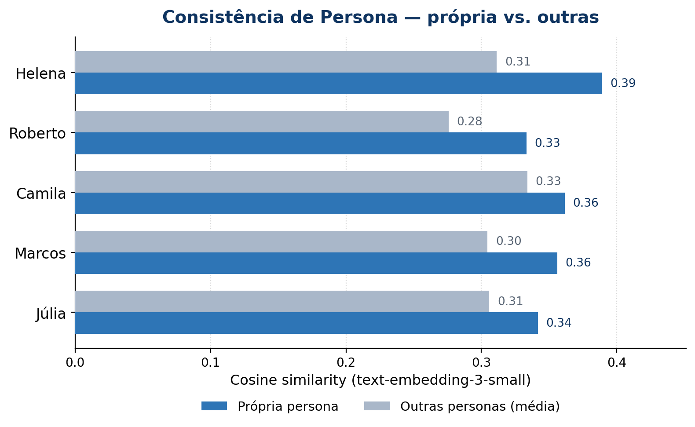
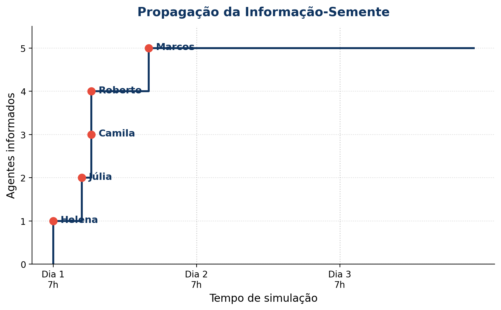

# Generative Agents — micro-simulação

Cinco moradores de uma vila textual conversam, lembram, refletem e se planejam ao longo de 3 dias virtuais. Recriação reduzida da arquitetura do paper *Generative Agents: Interactive Simulacra of Human Behavior* (Park et al., UIST 2023).

> Grupo G7 · Tópicos em Engenharia de Software · PUC-Campinas · 2026/1

## 🎬 Demo


A demo mostra a simulação rodando em modo mock por 3 dias virtuais: os agentes
planejam o dia, se encontram nos locais da vila e conversam, propagando a
info-semente naturalmente até chegar a 100% dos moradores.

## Rodando

```bash
python3 -m venv .venv && source .venv/bin/activate
pip install -r requirements.txt
python main.py --mode mock --verbose
```

Pra rodar com LLM real, copia `.env.example` pra `.env`, cola sua `OPENAI_API_KEY`, e troca o modo:

```bash
python main.py --mode llm --verbose
```

`--days N` controla quantos dias simular (default 3). `--output DIR` muda a pasta de saída (default `output/`).

## O que sai

No terminal, no final da simulação, vem o resumo das duas métricas:

```
--- Consistência de persona ---
    Helena: similaridade média = 0.045 (n=30, método=tfidf)
   Roberto: similaridade média = 0.044 (n=30, método=tfidf)
    Camila: similaridade média = 0.048 (n=30, método=tfidf)
    Marcos: similaridade média = 0.049 (n=30, método=tfidf)
     Júlia: similaridade média = 0.047 (n=30, método=tfidf)

--- Propagação de informação ---
  Info-semente: "Vai ter uma feira de artesanato no próximo sábado na praça"
  Taxa final: 100% (5/5)
      Helena — Dia 1, 07h
      Camila — Dia 1, 10h
       Júlia — Dia 1, 12h
     Roberto — Dia 1, 14h
      Marcos — Dia 1, 17h
```

E três arquivos em `output/`:

- `summary.md` — resumo legível com métricas + timeline da info-semente
- `conversations.md` — todos os diálogos formatados em markdown
- `simulation_log.json` — log completo, bom pra análise posterior

## Como funciona

Cada agente carrega quatro coisas:

- **Persona** — bio, traços, casa de partida, e o que ele já sabe (`known_info`).
- **Memory stream** — observações, conversas e reflexões. A recuperação combina três fatores normalizados: `α·recência + β·relevância + γ·importância`. No modo mock a relevância é zero (sem embeddings) e o stream pesa só recência e importância.
- **Planner** — antes de cada dia, gera uma agenda 7h–21h via LLM, fiel à personalidade. O parser tolera saída fora de formato e preenche horas faltantes.
- **Reflection** — quando o agente acumula importância > 50 ou ≥ 8 observações desde a última reflexão, ele sintetiza 3 insights de alto nível e os escreve de volta no stream com peso alto.

A cada hora, a simulação move todos pro local planejado, deixa pares co-locados decidir se conversam, gera diálogo se quiserem, propaga a info-semente quando ela aparece, e dispara reflexão quando o trigger fechou. No início de cada novo dia, todos replanjam.

O `LLMClient` tem duas implementações com a mesma interface. `OpenAIClient` chama `gpt-4o-mini` para texto e `text-embedding-3-small` para embeddings. `MockClient` detecta o intent do prompt (planejar, refletir, decidir interação, conversar) e devolve template variado — funciona sem API key e é o que o professor consegue rodar direto.

Detalhamento da arquitetura em [`docs/architecture.md`](docs/architecture.md).

## Avaliação

Pra gerar métricas e gráficos de uma vez, use o `run_evaluation.py` — ele roda a
simulação, salva os logs e produz `metrics.json` + dois gráficos em `output/`:

```bash
python run_evaluation.py --mode llm --verbose    # ou --mode mock
```

Saídas: `output/metrics.json`, `output/consistency_chart.png`,
`output/propagation_chart.png`.

**Consistência de persona.** Cosine similarity entre a bio do agente e suas
falas/reflexões, via `text-embedding-3-small`. Como o range absoluto desse
embedding é comprimido (textos relacionados ficam ~0,3–0,5), um limiar fixo não
faz sentido; a medida honesta é **relativa**: cada agente deveria ser mais
similar à *própria* persona do que às *outras*.



> Resultado: **5/5 agentes** ficaram mais próximos da própria persona do que das
> outras (Δ médio +0,05) — as personas se mantêm distinguíveis e consistentes.
> O `augment_consistency.py` recalcula essa comparação a partir do log salvo
> (só embeddings, sem re-rodar a simulação cara).

**Propagação de informação.** Só a Helena começa o Dia 1 sabendo da feira de
artesanato. A cada conversa, checamos se as keywords da semente aparecem e se um
agente informado falou com um não-informado. A info chegou a **100% (5/5)** dos
moradores ainda no Dia 1.



> No modo `mock`, a consistência usa TF-IDF (scikit-learn) como proxy sem API —
> útil pra reprodutibilidade, mas com sinal bem mais fraco que os embeddings.

## Painel (entrega final)

Painel A1 final em [`painel/`](painel/) — `poster_a1.pdf` (594 × 841 mm + 3 mm
de sangria, pronto pra gráfica) e `onepager_a4.pdf` (material de apoio A4
frente/verso distribuído na sessão). Direção visual Swiss Info-Design com
elementos de terminal; HTML→PDF via Chrome headless.

## Time

| Integrante | Responsabilidade |
|---|---|
| Pedro Rocha | Arquitetura, integração, módulos centrais |
| Victor Accorsi | Documentação |
| Luiza Pedroso | Personas, módulo de reflexão |
| Breno Figueira | Ambiente, loop de simulação |
| Milena Capelli | Pipeline de avaliação, propagação |

## Referências

Referência principal: Park, J. S., O'Brien, J., Cai, C. J., Morris, M. R., Liang, P., & Bernstein, M. S. (2023). *Generative Agents: Interactive Simulacra of Human Behavior*. Em *Proceedings of the 36th Annual ACM Symposium on User Interface Software and Technology* (UIST '23).

Lista completa em ABNT: [`referencias.md`](referencias.md).
